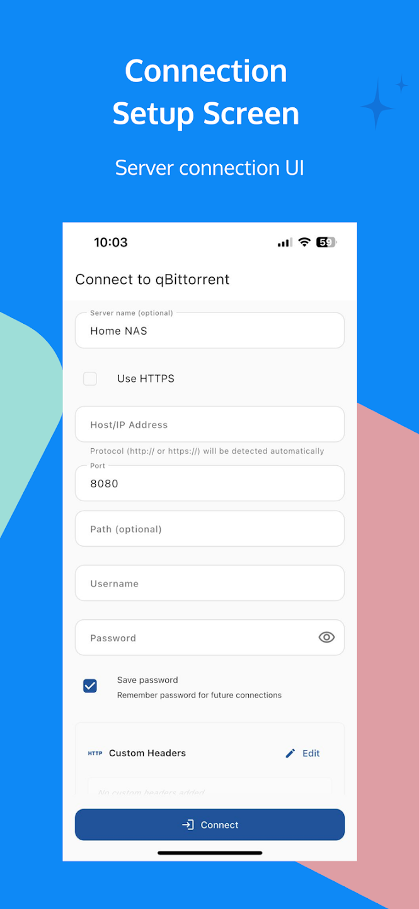
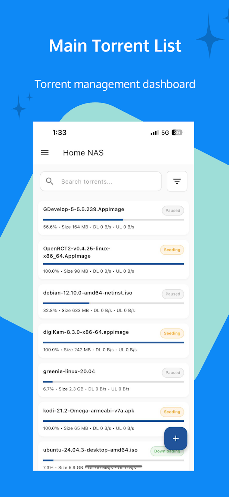
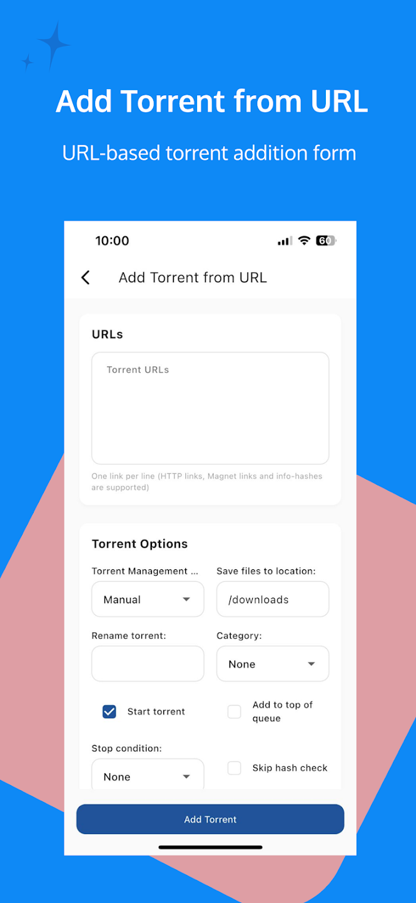
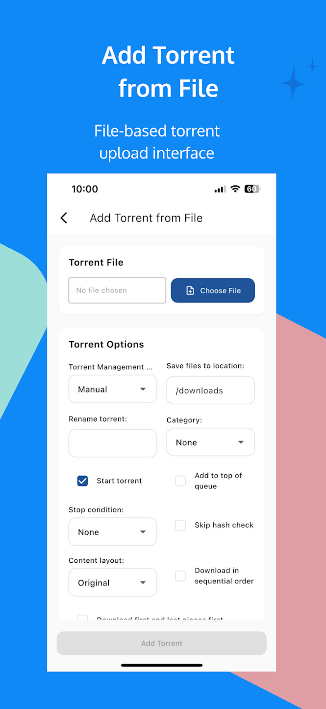
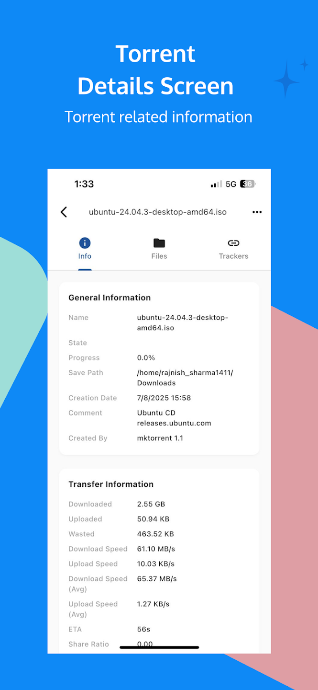
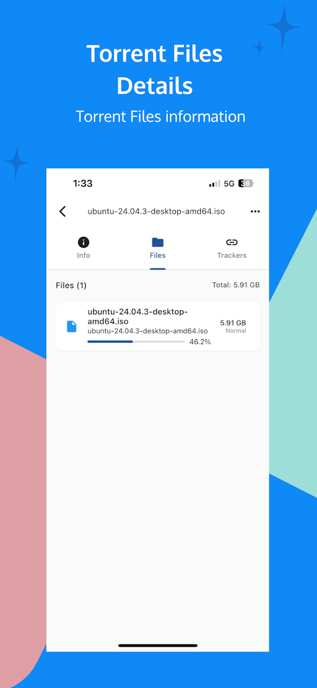
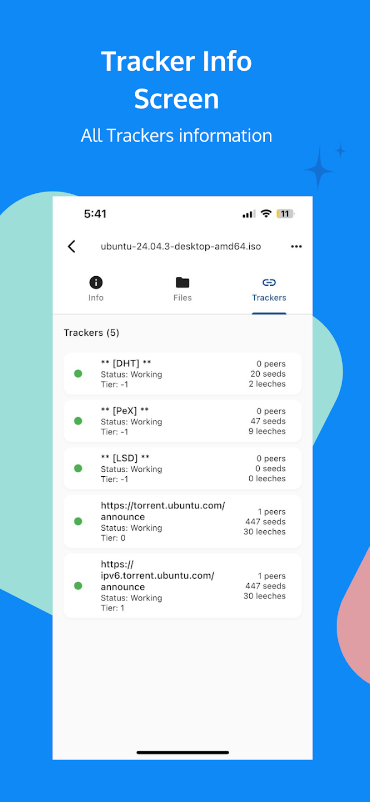
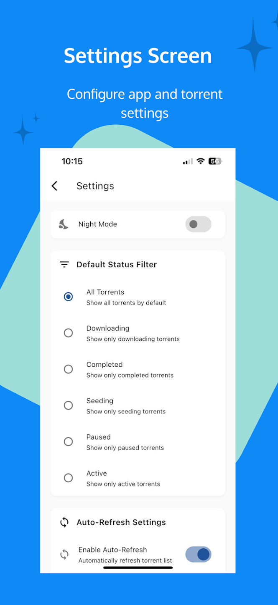

# qBitConnect Releases

This repository hosts the **AltStore source files** for [qBitConnect](https://github.com/RajnishOne/qbitconnect), a modern Flutter-based remote client for managing qBittorrent downloads on iOS devices.

> **Note:** This is the releases repository. For the actual source code, visit the [main qBitConnect repository](https://github.com/RajnishOne/qbitconnect).

## About qBitConnect

qBitConnect is a powerful remote client that lets you manage your qBittorrent server from your iOS device. Built with Flutter, it offers a native-feeling interface with real-time updates and comprehensive torrent management features.

### Features

- 🚀 Add torrents via magnet links or files
- 📁 Browse and manage torrent files
- 📊 Real-time download/upload monitoring with graphs and statistics
- 🎨 Multiple theme options (Light, Dark, OLED)
- 🔍 Advanced filtering and sorting
- ⚡ Batch operations for managing multiple torrents
- 📈 Detailed statistics and analytics
- 🌐 Multiple server support
- 🔒 Secure connection support

## Installation

Get qBitConnect by adding RajnishOne source from the list of recommended sources or via pasting the link below:

- **AltStore PAL**: `https://raw.githubusercontent.com/RajnishOne/qbitconnect-releases/main/altstore-pal.json`
- **AltStore Classic**: `https://raw.githubusercontent.com/RajnishOne/qbitconnect-releases/main/altstore.json`

&nbsp;

&nbsp;

### How to Add Source to AltStore

1. Open **AltStore** on your iOS device
2. Go to the **Browse** tab
3. Tap the **+** icon in the top-right corner
4. Paste one of the source URLs above (depending on your AltStore version)
5. Tap **Add**
6. Find **qBitConnect** in your sources and install it

## Screenshots

  
  
  
  

  
  
  
  

## Requirements

- iOS 12.0 or later
- A qBittorrent server (desktop or remote)
- AltStore or AltStore PAL installed on your device

## Links

- **Main Repository (Source Code):** [github.com/RajnishOne/qbitconnect](https://github.com/RajnishOne/qbitconnect)
- **Developer:** [RajnishOne](https://github.com/RajnishOne)
- **Report Issues:** [github.com/RajnishOne/qbitconnect/issues](https://github.com/RajnishOne/qbitconnect/issues)

## Contributing

For bug reports, feature requests, or contributions, please visit the [main repository](https://github.com/RajnishOne/qbitconnect).

## Support

If you find this app useful, please consider:
- ⭐ Starring the [main repository](https://github.com/RajnishOne/qbitconnect)
- 🐛 Reporting bugs or suggesting features
- 📢 Sharing the app with others

## License

See the [main repository](https://github.com/RajnishOne/qbitconnect) for license information.

---

Made with ❤️ by [RajnishOne](https://github.com/RajnishOne)
